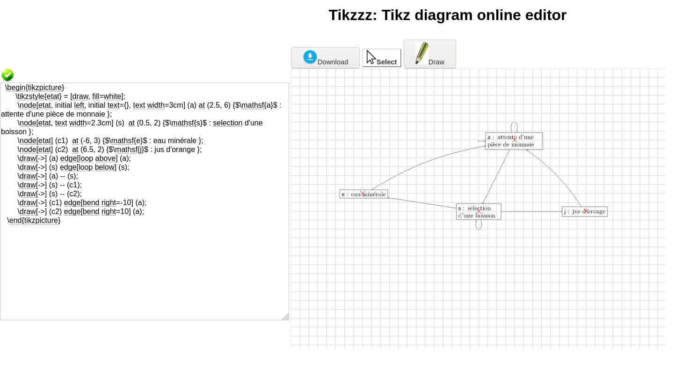

# [tikzzz](https://github.com/francoisschwarzentruber/tikzzz/)

tikzzz is a tiny tikz editor in the browser.
- when you write your tikz code, the image is updated ;
- When you move nodes with the mouse, the code is updated ;

> It is inspired by [QTikZ](https://linuxx.info/qtikz/) and [KTikZ](https://userbase.kde.org/KtikZ).

## Screenshot



## Requirements

On Ubuntu, install `php7.2-cli` package:
```bash
$ sudo apt install php7.2-cli
```

## How to launch it?

Use this Shell script [runlocally.sh](runlocally.sh):
```bash
$ ./runlocally.sh
```
It should open your browser to http://127.0.0.1:8123/, if not you can copy-paste the link or click on it.

## License?
Written by [François Schwarzentruber](https://github.com/francoisschwarzentruber/)
